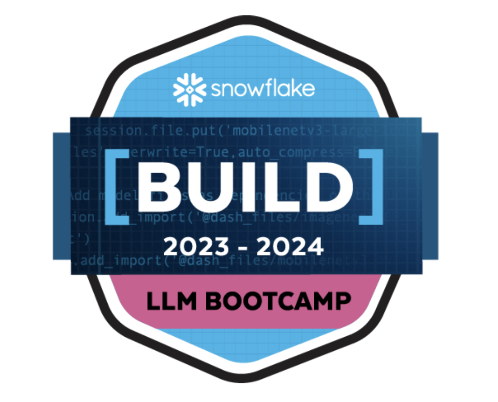

## BUILD LLM Bootcamp 2023 Day 1: Deploy Llama 2 from Hugging Face in Snowpark Container Services

### Prerequisites

* Laptop with wifi and ability to download libraries and Python packages from the web
* Docker Desktop (https://docs.docker.com/desktop/) installed
* VS Code (recommended) or other IDE
* A Hugging Face account (https://huggingface.co/)
Completed Llama 2 request form (https://ai.meta.com/resources/models-and-libraries/llama-downloads/). **NOTE**: Your Hugging Face account email address MUST match the email you provide on the Meta website or your request will not be approved
* After approval, submit the form (https://huggingface.co/meta-llama/Llama-2-7b-chat-hf) to access Llama 2 on Hugging Face to unlock access to the model. **NOTE**: This could take several hours.

### Snowpark Container Services (SPCS) User Account

Get exclusive access to Snowpark Container Services - currently in Private Preview - by click on this link https://build-spcs.streamlit.app/. 

**NOTE**: If you are not able to get a SPCS user account, you can still attend sessions on Day 1 and Day 2 to [earn the badge by completing the assessment](https://bit.ly/BUILD-LLM-Bootcamp2023).



### Hugging Face Token

Login into your account and access your Hugging Face token by browsing to Settings -> Access Tokens -> New token -- https://huggingface.co/settings/tokens

### Environment Setup

#### Step 1: Clone Repository

Clone this repository on your laptop and browse to the cloned folder.

#### Step 2: Create Conda Environment

In a terminal window, run the following command to create a conda environment:

`conda create --name llm-bootcamp -c https://repo.anaconda.com/pkgs/snowflake python=3.9`

#### Step 3: Activate Conda Environment

In the same terminal window, run the following command to activate the conda environment:

`conda activate llm-bootcamp`

#### Step 4: Install Libraries

In the same terminal window, run the following command to install required packages from Snowflake Anaconda channel:

`conda install -c https://repo.anaconda.com/pkgs/snowflake snowflake-snowpark-python pandas notebook`

#### Step 5: Update Credentials

Update [connection.json](connection.json) with your Hugging Face token and Snowflake credentials based on the user account you got access to -- see "**Snowpark Container Services User Account**" section above.

```json
{
  "account"   : "RTB37168",
  "user"      : "USER####",
  "password"  : "",
  "role"      : "ROLE_USER####",
  "warehouse" : "WH_XS_USER####",
  "database"  : "DB_USER####",
  "schema"    : "SCHEMA_LLM",
  "compute_pool" : "COMPUTE_POOL_USER####",
  "huggingface_token": ""
}
```

**NOTE**: Replace `####` with your user number, set your `password` and `huggingface_token`.

### Hands-on Lab

* Run `jupyter notebook` in the terminal window or open [llm-day1-notebook.ipynb](llm-day1-notebook.ipynb) in your favorite IDE.
* Select `llm-bootcamp` as your Notebook kernel
* Follow instructions and run through each cell in the Notebook

---

### Day 2 Preparation

Once you have completed the Day 1 hands-on lab as outlined above, follow the instructions below to prepare your environment for BUILD LLM Bootcamp Day 2. 

**NOTE:** These operations can take about ~45-60mins depending on your wireless connection.

1) Open terminal window and browse to the folder where you have cloned the repository

2) Change folder to *day2*

3) Run command *`docker build --platform linux/amd64 -t llm-bootcamp .`*

4) Once that image is built locally, run the following commands to push the image to Snowflake Registry
    1) Replace ***YOUR_DB_NAME*** with the name of your DB and then run the following command

        *`docker tag llm-bootcamp:latest sfsenorthamerica-build-spcs.registry.snowflakecomputing.com/YOUR_DB_NAME/schema_llm/image_repo/llm-bootcamp:latest`*
    2) Run the following command and login using your BUILD LLM Bootcamp account username and password

        *`docker login sfsenorthamerica-build-spcs.registry.snowflakecomputing.com`* 
        
    3) Replace ***YOUR_DB_NAME*** with the name of your DB and then run 
    
        *`docker push sfsenorthamerica-build-spcs.registry.snowflakecomputing.com/YOUR_DB_NAME/schema_llm/image_repo/llm-bootcamp:latest`*
